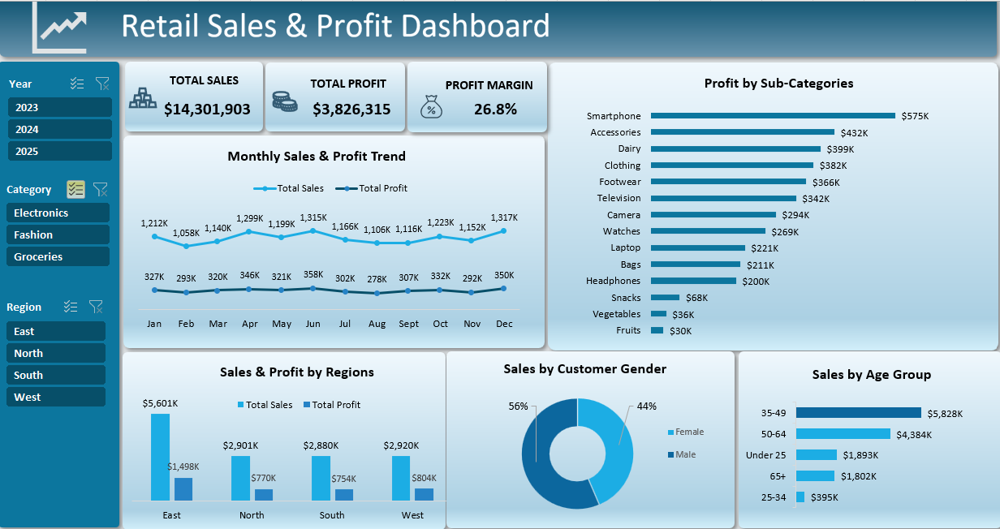

# 📊 Retail Sales Dashboard in Excel

An interactive Excel dashboard built to analyse retail sales performance, profitability, regional performance, product categories, and customer demographics. The project demonstrates the complete data analysis workflow, including data cleaning, transformation, business metric calculations, and dashboard design.

---

## 📌 Business Problem

A retail company wants to analyse its sales performance across different product categories, stores, regions, and customer demographics. The goal is to identify sales trends, evaluate profitability, and gain insights into customer purchasing behaviour to support business decision-making.

---

## 🎯 Project Objectives

- Clean and prepare the retail sales dataset.
- Combine data from multiple tables into a single analysis-ready dataset.
- Calculate key business metrics.
- Build an interactive dashboard to monitor sales performance.
- Analyse sales by time, region, category, and customer demographics.

---

## 📂 Dataset

The project uses a retail sales dataset containing transaction-level data along with customer and store information.

The dataset includes:

- Sales transactions
- Product categories and sub-categories
- Customer information
- Store and regional information
- Payment methods
- Transaction dates

---

## 🛠️ Tools & Skills

- Microsoft Excel
- Pivot Tables
- Pivot Charts
- Slicers
- XLOOKUP
- Calculated Columns
- Date Functions
- Dashboard Design
- Data Cleaning
- Data Transformation

---

## 🧹 Data Preparation

The dataset was cleaned and validated before analysis by:

- Checking for missing values
- Identifying duplicate records (IDs)
- Verifying date formats
- Checking for negative quantities
- Identifying blank product names

---

## 🔄 Data Transformation

To prepare the data for analysis, I:

- Used **XLOOKUP** to combine customer, store, and regional information with the transaction table.
- Calculated **Gross Revenue**, **Net Revenue**, **Total Cost**, and **Profit**.
- Calculated **Profit Margin** as a key performance indicator (KPI).
- Extracted **Month** and **Year** from transaction dates for trend analysis.
- Created customer **Age Groups** for demographic analysis.
- Applied appropriate formatting for dates, currency, percentages, and numbers.

---

## 📊 Dashboard Features

### KPI Cards

- Total Sales
- Total Profit
- Profit Margin

### Interactive Filters

- Year
- Product Category
- Region

### Visualisations

- Monthly Sales & Profit Trend
- Profit by Categories & Sub-categories
- Sales & Profit by Region
- Sales by Customer Gender
- Sales by Age Group

---

## 💡 Key Insights

- Electronics generated the highest overall profit.
- Smartphones were the most profitable product sub-category.
- The East region recorded the highest sales.
- Customers aged **35–49** represented the largest share of sales.
- Overall profit margin reached **26.8%**.

---

## 📷 Dashboard Preview

---

## 📚 What I Learned

This project strengthened my Excel skills by working through the complete data analysis processr fom preparing raw data to designing an interactive dashboard. I gained practical experience in cleaning and transforming data, combining multiple data sources using XLOOKUP calculating business metrics, and presenting insights through interactive visualisations.
